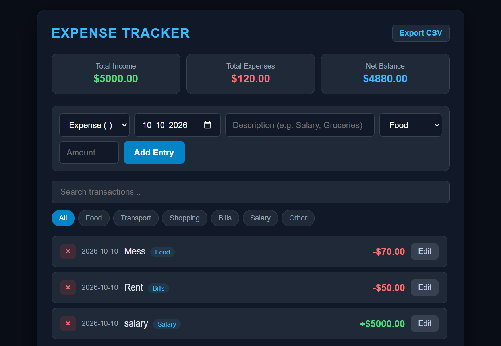

# Expense Tracker (React)

A simple income and expense tracker built with React. Add income or expenses with a date, description, category and amount, then edit, delete, search and filter them. The totals and net balance update instantly, and everything is saved in the browser, so it is still there after a refresh.

This is the React version of my vanilla JavaScript expense list, extended with income, categories, search, editing and CSV export.

**Live demo:** [https://react-expense-tracker-silk-eight.vercel.app/](https://react-expense-tracker-silk-eight.vercel.app/)

## Screenshots



## Features

- Add an entry as **income (+)** or **expense (-)** with a date, description, category and amount
- Summary cards for **Total Income**, **Total Expenses** and **Net Balance**
- Edit any entry (it loads back into the form, with Update and Cancel buttons)
- Delete any entry from the list
- Search entries by description
- Filter entries by category
- Entries are sorted by date, newest first
- Export all entries to a CSV file
- Data is saved in `localStorage` and loaded again when the page opens
- Input validation: an empty description or an amount of zero or less is not accepted
- Responsive layout for desktop and mobile

## Built With

- **React** (functional components and hooks)
- **JavaScript (ES6+)**
- **CSS3** (flexbox, grid, media queries)
- **Web Storage API** (`localStorage`)

## Getting Started

1. Clone the repository:
```
   git clone https://github.com/piyushdhakad001/react-expense-tracker.git
```
2. Go into the folder:
```
   cd react-expense-tracker
```
3. Install dependencies:
```
   npm install
```
4. Start the development server:
```
   npm start
```
5. Open the address shown in the terminal (usually `http://localhost:3000`).

## How It Works

The code is written with plain functions, `for` loops and `if` statements, so each step is easy to follow.

- **State (`useState`):** the `expenses` list, one state value for each form input (`type`, `date`, `name`, `category`, `amount`), `editId`, `filter` and `search`. Each entry looks like this:
```js
  { id: 1760000000000, type: "expense", date: "2026-10-09", itemName: "Groceries", category: "Food", money: 42.5 }
```
- **Loading:** `useState(loadExpenses)` reads `localStorage` once when the app opens, inside a `try/catch` so broken data can't crash the app. Entries saved by older versions without a category or type get the defaults "Other" and "expense".
- **Saving:** a `useEffect` writes the list to `localStorage` every time `expenses` changes.
- **One form for add and edit:** `editId` is `null` when adding. In `handleSubmit`, if `editId` is set, a loop copies the list and replaces that one entry. Otherwise the new entry is placed at the front of the list.
- **Deleting:** a loop copies every entry except the one with that `id`.
- **Totals:** `getTotal()` loops through the list and adds up the amounts of one type. Net balance is income minus expenses.
- **Search and filter:** a loop keeps only the entries that match both the selected category and the search text. The result is then sorted by date.
- **CSV export:** a loop builds the file text line by line, then a temporary download link is created and clicked.

## What I Learned

- Using controlled inputs to manage form state in React
- Reusing one form for both adding and editing with an `editId` state
- Saving and loading data with `localStorage` and `useEffect`
- Updating lists by building a new list instead of changing the old one
- Working out values (totals, filtered list) from state instead of storing them
- Building and downloading a file in the browser (CSV export)
- Rebuilding a vanilla JavaScript project in React

## Known Limitations

- The currency is fixed to `$`
- Deleting an entry happens immediately, with no confirmation or undo
- The categories are fixed, and "Salary" appears for expenses as well as income
- CSV export includes all entries, even when a filter or search is active
- Data is stored only in the current browser, so it is not shared between devices

## Future Improvements

- [ ] Filter by month or date range
- [ ] Add a monthly summary or chart
- [ ] Choose the currency
- [ ] Confirm before deleting
- [ ] Let the user add their own categories